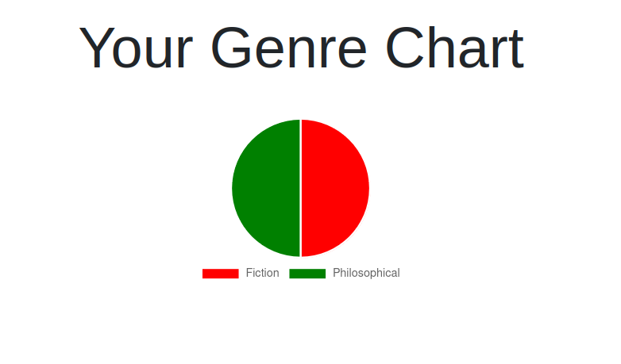
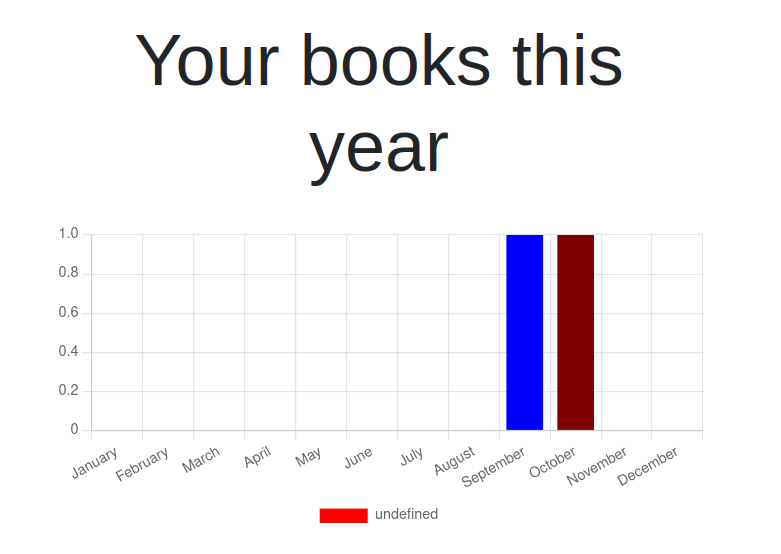

# API Documentation for the User route

The api's in this doc are located in the "users" route , which is why every api call must start with that word.

The structure of a user object:

```javascript
user = {
  id: number,
  username: string,
  password: string,
  email: string,
  DOB: date,
  country: string,
  city: string,
};
```

Relations with other entities include : Libraries , Reviews , Roles , Users (friends) , Books (user-giveaway-list) , Books (user-want-list) ;

# Current available apis :

## 1. Creating a user 🎈

**Description** : This route creates a new user and saves it in the database , the password is also encrypted for security

### How to access the route ?

     - **Url** : "/users"
     - **Method** : POST

### Security requirements

- **Authentication** : No
- **Authorization** : No

#### Request Body

| **property** | **type** |             **description**             | **required** |
| :----------: | :------: | :-------------------------------------: | :----------: |
|   username   |  string  |             the user's name             |     Yes      |
|    email     |  string  |            the user's email             |     Yes      |
|   password   |  number  |            account password             |     Yes      |
|   country    |  string  | the country where the user is currently |     Yes      |
|     city     |  string  |  the city where the user is currently   |     Yes      |

#### Responses:

1. Status 201 created , with the created user object

```json
{
  "id": 4,
  "username": "not isra",
  "email": "notisra@gmail.com",
  "password": "378343jdjfjdkjf38343njn",
  "country": "Palestine",
  "city": "Bethlehem"
}
```

1. An appropriate error response with a status code

## 2. To Get all available users 🎈

### How to access the route ?

- **Url** : "/users"
- **Method** : GET

### Security requirements

- **Authentication** : No
- **Authorization** : No

#### Query Params

| **property** | **type** |         **description**         | **required** | **Default** |
| :----------: | :------: | :-----------------------------: | :----------: | :---------: |
|     page     |  number  | the page you would like to view |      No      |      1      |
|   pageSize   |  number  | the number of items in the page |      No      |     10      |

#### Responses:

1. Status 200 ok , a list which contains the current page , the page size , the total number of objects in the db , and a list called "info" which contains the objects

   ```json
   [
    "page": 1 ,
    "pageSize" : 2 ,
    "total" : 8 ,
    "info": [
      {
        "id": 4,
        "username": "not isra",
        "email": "notisra@gmail.com",
        "password": "378343jdjfjdkjf38343njn",
        "country": "Palestine",
        "city": "Bethlehem"
      } ,
      {
        "id": 5,
        "username": "someone",
        "email": "someone@gmail.com",
        "password": "encrypteddkfjdkj888k3",
        "country": "Jordan",
        "city": "Bethlehem"
      } ,
    ]
   ]
   ```

1. An appropriate error message and status code

## 3. Logging in as a specific user🎈

**Description** : This route logs in the user and creates a jwt token valid for a certain amount of time. The token is returned and is also stored in the cookies.

### How to access the route ?

- **Url** : "/users/login"
- **Method** : POST

### Security requirements

- **Authentication** : No
- **Authorization** : No

#### Request Body

| **property** | **type** |                  **description**                  | **required** |
| :----------: | :------: | :-----------------------------------------------: | :----------: |
|    email     |  string  | The email of the user you would like to log in as |     Yes      |
|   password   |  string  |               The account password                |     Yes      |

#### Responses:

1. Status 200 ok , with the data object that contains the jwt Token , the username , and id ;

1. An appropriate error message and status code

##### Error responses :

- Status 400 , Error getting users
- Status 500 , Something went wrong

## 4. Logging out for a usr 🎈

This route clears the cookies and logs out the user

### How to access the route ?

- **Url** : "/users/logout"
- **Method** : GET

### Security requirements

- **Authentication** : Yes
- **Authorization** : No

#### Responses:

- Status 200 ok , with a message of "logged out"

## 5. Sending emails to users with AWS SES 🎈

### How to access the route ?

- **Url** : "/users/send-email"
- **Method** : POST

### Security requirements

- **Authentication** : Yes
- **Authorization** : Yes , admin access

| **property** | **type** |                   **description**                   | **required** |
| :----------: | :------: | :-------------------------------------------------: | :----------: |
|  recipient   |  string  |   The email address of the recipient of the email   |     Yes      |
|   subject    |  string  |                  The email subject                  |     Yes      |
|   message    |  string  | The message you would like to send inside the email |     Yes      |

#### Responses:

- Status 200 ok , with a message of "Email sent successfully"

## 6. Endpoints for views of user data :

- ### 1. Displays a graph representing the genres of books the user has read 🎈

  ### How to access the route ?

  - **Url** : "/users/data/genres"
  - **Method** : GET

  ### Security requirements

  - **Authentication** : Yes
  - **Authorization** : No

  #### Responses:

1. The rendered view of the data

<p align="center">
  
</p>

1. An error message indicating something went wrong along with a status code

- ### 2. Displays a graph representing the number of books the user has this year 🎈

  ### How to access the route ?

  - **Url** : "/users/data/books"
  - **Method** : GET

  ### Security requirements

  - **Authentication** : Yes
  - **Authorization** : No

  #### Responses:

1. The rendered view of the data

<p align="center">
  
</p>

1. An error message indicating something went wrong along with a status code

### Gets all books that the user wants that are available in city libraries🎈

### How to access the route ?

- **Url** : "/users/books/available"
- **Method** : GET

### Security requirements

- **Authentication** : Yes
- **Authorization** : No

#### Responses:

Status 200 ok , list of copies or an empty list if nothing was found

```json
  [
    {
      "id": 1,
        "status": "unavailable",
        "book": {
            "id": 1, ...
        },
        "library": {
            "id": 1, ...
        }
    },
    {
      "id": 2,
        "status": "available",
        "book": {
            "id": 1, ...
        },
        "library": {
            "id": 1, ...
        }
    },
  ]
```

Or an error message indicating that something went wrong with a relevant status code

## 7. Adding a new friend 🎈

### How to access the route ?

- **Url** : "/users/friends"
- **Method** : PUT

### Security requirements

- **Authentication** : Yes
- **Authorization** : No

#### Request Body

| **property** | **type** | **description** | **required** |
| :----------: | :------: | :-------------: | :----------: |
|      id      |  number  |  the friend id  |     Yes      |

#### Responses:

1. Status 200 ok , returns the message "Friend added successfully"
1. Or a relevant error message with status code

## 8. Removing a new friend 🎈

### How to access the route ?

- **Url** : "/users/friends"
- **Method** : DELETE

### Security requirements

- **Authentication** : Yes
- **Authorization** : No

#### Request Body

| **property** | **type** | **description** | **required** |
| :----------: | :------: | :-------------: | :----------: |
|      id      |  number  |  the friend id  |     Yes      |

#### Responses:

1. Status 200 ok , returns the message "Friend removed successfully"
1. Or a relevant error message with status code

## 9. Getting Friend Recommendations🎈

### How to access the route ?

- **Url** : "/users/friend-recs"
- **Method** : GET

### Security requirements

- **Authentication** : Yes
- **Authorization** : No

#### Responses:

1. Status 200 ok , returns a list of reccomendations from friends as so :

```json
[
  {
    "title": "A great book",
    "author": "someone",
    "rating": "4.5",
    "friend": "BestFriend"
  },
  {
    "title": "A very amazing book",
    "author": "someone's sister",
    "rating": "4.75",
    "friend": "Your friend"
  }
]
```

1. Or a relevant error message with status code

## 10. Getting all friends of the user 🎈

### How to access the route ?

- **Url** : "/users/friends"
- **Method** : GET

### Security requirements

- **Authentication** : Yes
- **Authorization** : No

#### Responses:

1. Status 200 ok , returns a list of Users that represent the logged-in user's friends . (might be empty)
1. Or a relevant error message with status code

## 11. Getting books that you want and someone is giving away in your city🎈

### How to access the route ?

- **Url** : "/users/giveaway"
- **Method** : GET

### Security requirements

- **Authentication** : Yes
- **Authorization** : No

#### Responses:

1. Status 200 ok , returns the list of Books found in your city that someone is giving away and that you want
1. Or a relevant error message with status code

## 12. Adding the image of a User to the AWS S3 bucket for user-images🎈

### How to access the route ?

- **Url** : "/users/image"
- **Method** : PUT

### Security requirements

- **Authentication** : Yes
- **Authorization** : No

#### Request Body

| **property** | **type** |      **description**      | **required** |
| :----------: | :------: | :-----------------------: | :----------: |
|     img      |  string  | the public url of the img |     Yes      |

#### Responses:

1. Status 200 ok , returns the message "Image added successfully"
1. Or a relevant error message with status code
